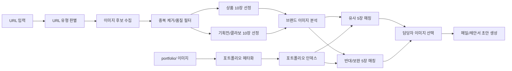

# 브랜드 URL 기반 포트폴리오 매칭 워크플로우 기획

## 1. 한 줄 정의

브랜드 자사몰 또는 인스타 URL을 넣으면 공개 이미지 후보를 수집하고, 보유 포트폴리오와의 유사/보완 매칭을 만들어 영업 담당자가 바로 메일과 제안서 초안을 고를 수 있게 하는 워크플로우.

## 2. 사용자 시나리오

1. 사용자가 브랜드 자사몰 URL 또는 인스타 URL을 입력한다.
2. 시스템이 URL 유형을 판별한다.
   - 자사몰 상품/컬렉션/기획전 페이지
   - 인스타 게시물/프로필/릴스/하이라이트 링크
   - 기타 랜딩/캠페인 페이지
3. 페이지에서 이미지 후보를 수집한다.
4. 후보 이미지를 상품 이미지와 기획전/콜라보/프로젝트 이미지로 나눈다.
5. 각 그룹에서 품질과 대표성이 높은 이미지 10장씩 뽑는다.
6. 브랜드 이미지 묶음을 분석해 브랜드의 현재 비주얼 성향과 부족한 지점을 요약한다.
7. 보유 포트폴리오와 매칭한다.
   - 유사 이미지 5장: 브랜드가 이미 가진 방향과 이어 붙이기 좋은 사례
   - 반대/보완 이미지 5장: 브랜드에 없는 컷 역할이나 새로운 제안 방향
8. 담당자가 추천 이미지를 검토하고 실제로 보낼 이미지를 선택한다.
9. 선택한 이미지와 브랜드 분석 결과를 기반으로 영업 메일 초안과 제안서 초안을 만든다.

## 3. 핵심 산출물

### 브랜드 이미지 수집 결과

- 상품 이미지 10장
- 기획전/콜라보/프로젝트 이미지 10장
- 이미지별 출처 URL, 페이지 내 위치, 원본 크기, 중복 여부, 분류 이유
- 수집 실패 또는 부족 수집 사유

### 포트폴리오 추천 결과

- 유사 추천 5장
- 반대/보완 추천 5장
- 각 추천의 매칭 근거
- 브랜드 이미지와 포트폴리오 이미지의 연결 설명
- 담당자 선택 여부와 메모

### 영업 산출물

- 짧은 콜드메일 초안
- 제안서 초안
  - 브랜드 현재 이미지 진단
  - 우리가 제안할 수 있는 컨셉 2~3개
  - 선택 포트폴리오 이미지와 활용 이유
  - 예상 촬영/디렉팅 범위
  - 다음 미팅 제안 문구

## 4. 전체 아키텍처 초안

## 5. URL 수집 전략

### 자사몰 URL

자사몰은 HTML과 렌더링된 DOM을 함께 본다.

- HTML의 `img`, `picture`, `source`, `meta[property='og:image']`
- CSS background-image
- JSON-LD Product/ImageObject
- 상품 카드 이미지와 상세 상품 이미지
- 룩북, collection, campaign, collaboration, event, project, editorial, promotion 계열 링크

수집 후보는 바로 저장하지 않고 후보 테이블에 먼저 둔다. 같은 이미지의 CDN 파라미터 버전은 정규화 URL과 perceptual hash로 중복 제거한다.

### 인스타 URL

인스타그램은 접근 제한과 정책 변동이 크기 때문에 MVP에서 3단계 폴백을 둔다.

1. 사용자가 이미 내려받은 이미지 또는 export 파일을 업로드
2. 공개 URL에서 접근 가능한 og image와 게시물 이미지 후보만 수집
3. 추후 공식 API 또는 승인된 소셜 수집 도구 연동

로그인 우회, 비공개 계정 접근, 약관을 회피하는 수집은 워크플로우 범위에서 제외한다.

## 6. 이미지 분류 기준

### 상품 이미지

상품 이미지로 분류될 가능성이 높은 신호:

- 상품 카드, 상세 상품 이미지, 썸네일
- 파일명이나 경로에 product, goods, item, detail, look, sku, shop, list
- 단일 상품이 프레임의 중심
- 배경이 단순하고 상품 식별이 쉬움
- 가격, 상품명, 옵션 주변에 노출

### 기획전/콜라보/프로젝트 이미지

캠페인 이미지로 분류될 가능성이 높은 신호:

- 파일명이나 경로에 campaign, collection, collaboration, collab, project, editorial, event, promotion, banner, lookbook
- 모델, 장소, 세트, 시즌 배경, 그래픽 타이포가 포함
- 와이드 배너 또는 히어로 이미지
- 여러 상품을 하나의 무드로 묶는 이미지
- 브랜드 메시지나 시즌 테마를 전달

## 7. 베스트 10장 선정 로직

상품 이미지 점수:

- 해상도와 선명도
- 상품이 가려지지 않았는지
- 상품 카테고리 다양성
- 페이지 내 중요 위치
- 중복 제거 후 대표성
- 상세페이지/상품 리스트에서의 반복 노출

기획전 이미지 점수:

- 브랜드 무드 대표성
- 캠페인/콜라보 문맥 신호
- 모델/세트/장소/그래픽의 완성도
- SNS 또는 제안서에서 설명하기 좋은 시각적 특징
- 상품 이미지와 다른 역할을 하는지

## 8. MVP 화면 구성

첫 화면은 랜딩이 아니라 작업 화면이어야 한다.

- URL 입력 영역
- 수집 진행 상태
- 수집된 상품 이미지 10장 그리드
- 수집된 캠페인 이미지 10장 그리드
- 브랜드 이미지 요약
- 유사 포트폴리오 5장
- 반대/보완 포트폴리오 5장
- 선택 트레이
- 메일 초안 탭
- 제안서 초안 탭

담당자는 추천을 그대로 쓰는 것이 아니라, 각 이미지 카드에서 "사용", "제외", "메모"를 남긴다.

## 9. 구현 단계

### Phase 0: 기획/스키마 확정

- 이 폴더의 문서와 JSON 스키마를 확정한다.
- 현재 `portfolio/` 샘플 12장 기준으로 스키마가 충분한지 검토한다.

### Phase 1: 포트폴리오 메타화

- `portfolio/` 이미지와 동명 `.json` 파일을 읽는다.
- 이미지 크기, 비율, 파일 해시, 기존 인스타 메타를 병합한다.
- Vision 분석으로 컷 유형, 무드, 구도, 색감, 상품/모델 여부를 생성한다.
- 사람이 수정 가능한 태그와 제안 문구 필드를 둔다.

### Phase 2: 브랜드 URL 이미지 수집

- 자사몰 HTML/DOM 이미지 후보를 수집한다.
- 상품/캠페인 분류와 베스트 10장 선정을 구현한다.
- 인스타는 업로드/수동 export 경로를 먼저 지원한다.

### Phase 3: 매칭

- 포트폴리오 인덱스와 브랜드 이미지 메타를 비교한다.
- 유사 5장과 반대/보완 5장을 분리해 산출한다.
- 같은 포트폴리오 그룹으로만 쏠리지 않도록 다양성 제한을 둔다.

### Phase 4: 선택과 산출물 생성

- 담당자가 추천 이미지를 선택한다.
- 선택 이미지 기준으로 메일과 제안서 초안을 생성한다.
- 제안서에는 브랜드 이미지와 포트폴리오 이미지가 같이 들어간다.

### Phase 5: 기존 앱 연동 검토

- 별도 워크플로우가 검증된 뒤에만 기존 `api/`, `web/`와 통합한다.
- 통합 전에는 `skill_ver/` 안의 스크립트/데이터/문서로 독립 운영한다.

## 10. 리스크와 대응

- 수집 권한: 브랜드 이미지 사용 범위와 인스타 수집 방식은 사전에 확인한다.
- 이미지 부족: URL에서 20장을 못 가져오면 부족 사유와 대체 업로드 옵션을 표시한다.
- 오분류: 상품/캠페인 분류는 담당자가 수정할 수 있어야 한다.
- 추천 편향: 유사 추천만 많으면 영업 제안이 약해지므로 보완 추천을 별도 슬롯으로 유지한다.
- 제안서 과장: 실제 선택 이미지로 뒷받침되지 않는 문구는 생성하지 않는다.
